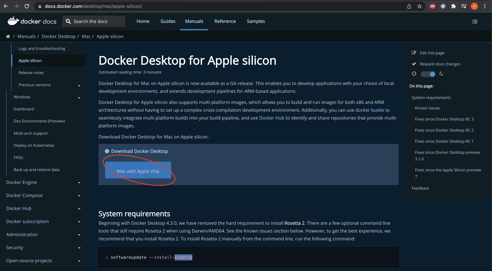

# m1 docker install

## 1. 下载安装
Go to https://docs.docker.com/desktop/mac/apple-silicon/ and click [Mac with Apple chip] to install dmg package


> * Here is an optional requirement, to have a best experience for docker, it`s better to install Rosetta2 in your mac, so run below command. But as your macos is Monterey(v12.1), Rosetta2 should be defaultly installed, this step is optional.
> ```bash
> softwareupdate --install-rosetta
> ```

## 2. 配置国内镜像源
科大镜像：https://docker.mirrors.ustc.edu.cn/  
网易：https://hub-mirror.c.163.com/  
阿里云：https://<你的ID>.mirror.aliyuncs.com  
七牛云加速器：https://reg-mirror.qiniu.com  

 
镜像放在那里?


## 3. docker常用命令
[官方参考](https://docs.docker.com/engine/reference/run/)
|用法|作用|常用参数|参数作用|例子|
|----|----|----|----|----|
|docker [COMMAND] --help|查看所有/指定命令的用法|||docker pull --help|
|镜像相关|
|docker images [OPTIONS] [REPOSITORY[:TAG]]|查看本地镜像的信息, 不带参数默认列出所有镜像,参数可指定特定仓库/特定tag的镜像|||docker images|
|docker search [OPTIONS] TERM|搜索docker hub上的镜像|||docker search java|
|docker pull [OPTIONS] NAME[:TAG\|@DIGEST]|下载镜像, 可以指定tag, 默认是latest|||docker pull tomcat; docker pull tomcat:jre8-openjdk-slim|
|docker rmi [OPTIONS] IMAGE [IMAGE...]|移除本地镜像. 如果镜像有正在运行的容器,需要加参数--force或者-f才能移除. 如果需要移除镜像的某个版本,需要指明tag|||docker rmi testImage; docker rmi testImag2:tagv1; docker rmi -f runningImage|
|容器运行相关|
|用法|作用|常用参数|参数作用|例子|
|docker run [OPTIONS] IMAGE [COMMAND] [ARG...]|为镜像运行容器||
|docker run||-d|Run container in background and print container ID|docker run -d ubuntu|
|docker run||--expose|Expose a port or a range of ports|docker run --expose 80 ubuntu bash (This exposes port 80 of the container without publishing the port to the host system’s interfaces.)|
|docker run||--publish, -p|Publish a container's port(s) to the host| docker run -p 127.0.0.1:80:8080/tcp ubuntu bash (This binds port 8080 of the container to TCP port 80 on 127.0.0.1 of the host machine)|
|docker run||--publish-all, -P|Publish all exposed ports to random ports||
|docker run||--tty, -t|Allocate a pseudo-TTY; 分配一个模拟输入终端|docker run -it ubuntu:15.10 /bin/bash  (The -it instructs Docker to allocate a pseudo-TTY connected to the container’s stdin; creating an interactive bash shell in the container)  (/bin/bash：放在镜像名后的是命令，这里我们希望有个交互式 Shell，因此用的是 /bin/bash)|
|docker run||--interactive, -i|Keep STDIN open even if not attached 保持输入终端连接着|docker run --name test -it debian|
|docker ps [OPTIONS]|默认查看正在运行的容器, 参数-a则查看所有容器|||docker ps; docker ps -a|
|docker top CONTAINER [ps OPTIONS]|查看容器中运行的进程|||docker top testContainerName|
|docker inspect [OPTIONS] NAME\|ID [NAME\|ID...]|查看容器的docker底层信息,默认以json格式显示|||docker inspect testContainerName|
|docker start [OPTIONS] CONTAINER [CONTAINER...]|启动一个或多个停止的容器|||docker start my_container|
|docker stop [OPTIONS] CONTAINER [CONTAINER...]|停止一个或多个正在运行的容器|||docker stop my_container|
|docker rm [OPTIONS] CONTAINER [CONTAINER...]|移除容器, 如果容器正在运行, 需要参数-f|||docker rm -f redis|
|docker port CONTAINER [PRIVATE_PORT[/PROTO]]|查看容器的端口映射|||docker port testContainerName|
|docker logs [OPTIONS] CONTAINER|查看容器里的日志|--follow , -f|continue streaming the new output from the container’s STDOUT and STDERR|docker logs -f testContainerName|
|构建镜像相关|
|用法|作用|常用参数|参数作用|例子|
|docker commit [OPTIONS] CONTAINER [REPOSITORY[:TAG]]|Create a new image from a container’s changes; 根据现有容器的变更, 构建一个新的镜像, ***不推荐***|--author, -a : 作者; --message , -m : 提交信息;||docker commit c3f279d17e0a  svendowideit/testimage:version3;  docker commit -m="has update" -a="runoob" e218edb10161 runoob/ubuntu:v2|
|docker build [OPTIONS] PATH \| URL \| -|从DockerFile构建镜像, ***推荐***|||[详解参考 4. DockerFile Details](#4-dockerfile-details)|
|docker tag SOURCE_IMAGE[:TAG] TARGET_IMAGE[:TAG]|为镜像打tag|
|docker tag|||Tag an image referenced by ID | docker tag 0e5574283393 fedora/httpd:version1.0|
|docker tag|||Tag an image referenced by Name | docker tag httpd fedora/httpd:version1.0|
|docker tag|||Tag an image referenced by Name and Tag| docker tag httpd:test fedora/httpd:version1.0.test|
|docker tag|||Tag an image for a private repository|docker tag 0e5574283393 myregistryhost:5000/fedora/httpd:version1.0|


## 4. DockerFile Details
docker build [OPTIONS] PATH|URL|-

The PATH is a directory on your local filesystem.  
The URL is a Git repository location.  
