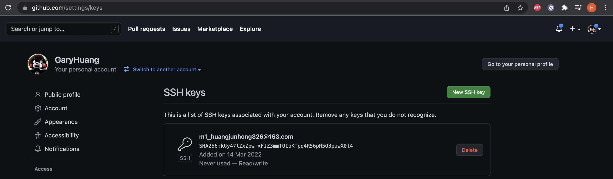

# git

## 1.homebrew install git
```bash
brew install git
```
then close terminal/iterm, and reopen a new one, you can find your latest installed git
```bash
garyhuang@nuojiyaMBP14 ~ % git version
git version 2.35.1
garyhuang@nuojiyaMBP14 ~ % which git
/opt/homebrew/bin/git
garyhuang@nuojiyaMBP14 ~ %
```

 ## 2. git configuration
 setup username & email
 ```bash
 git config --global user.name "xxx" 
 git config --global user.email  "xxx" 
 ```
 check if setup successfully 
 ```bash
garyhuang@nuojiyaMBP14 ~ % git config -l
credential.helper=osxkeychain
user.name=garyhuang
user.email=huangjunhong826@163.com
 ```

config ssh key
```bash
ssh-keygen -t rsa -C "<your@email>"

garyhuang@nuojiyaMBP14 ~ % ssh-keygen -t rsa -C "huangjunhong826@163.com"
Generating public/private rsa key pair.
Enter file in which to save the key (/Users/garyhuang/.ssh/id_rsa):
Created directory '/Users/garyhuang/.ssh'.
Enter passphrase (empty for no passphrase):
Enter same passphrase again:
Your identification has been saved in /Users/garyhuang/.ssh/id_rsa
Your public key has been saved in /Users/garyhuang/.ssh/id_rsa.pub
The key fingerprint is:
SHA256:kGy47lZxZpw+xFJZ3mmTOIoKTpq4R56pR5O3pawX0l4 huangjunhong826@163.com
The key's randomart image is:
+---[RSA 3072]----+
|         o.      |
|     o .o. o o   |
|    . =+ .+ *    |
|     oooO. o .   |
|  oo. .OS        |
|.=*o+.E o        |
|++.OoB   .       |
| .*.B            |
|o+.+.            |
+----[SHA256]-----+
garyhuang@nuojiyaMBP14 ~ %
```

then go to /User/username/.ssh to check the generated ssh-key (id_rsa.pub)
```bash
garyhuang@nuojiyaMBP14 .ssh % pwd
/Users/garyhuang/.ssh
garyhuang@nuojiyaMBP14 .ssh % cat id_rsa.pub
ssh-rsa AAAAB3NzaC1yc2EAAAADAQABAAABgQDh3YQocLk8HUX8qqSQouhbvhSi/iizY4uqslQs2hVi+GOaTY6ER6FxMCVASS2i9N8ifxUP76GaWKqasBLZxqRy0PYSeNDdFx03xkvRx0wrI0ayEhFnXox0fIpwjHNCRul5zVQ+N62xnupEUcmfyNEuw8q+isSAhqKiOiqdfY07jVGVE6unpvZ1Rd/nbNccxYkAQZjkSOk111YhTZkxPp/EYEPhYS8MKGRskSFwLazkGhYHXof8cAxEe9CSYIqIij9g5/9xNmrDeVp71Tgu2KuFW1e+PE7cO4fXfsLX7uPLt+eau2lRqo4TUyH5mW0oDvTaRd3ispkXlMJAXgIm6vZXoWdiiOuU2Cr2Am+3tufKJsed3a1xZi8xnvpJ0MjrrWPVj8Rt5bt8+rSH7DYFlmtmOv4+puEm9y16sx+4YYo8VrxFjh+1p5CmLYTFUm6gXvadteTjh7e62rQpgPeE/p19pbo9LAiwqsI2y20KBcNI9Q9vsm7LveuwStyVstfpMBc= huangjunhong826@163.com
```

then go to github page to new a SSH key with above key


then test the connection 
```bash
garyhuang@nuojiyaMBP14 .ssh % ssh -T git@github.com
Hi GaryHuang2333! You've successfully authenticated, but GitHub does not provide shell access.
garyhuang@nuojiyaMBP14 .ssh %
```