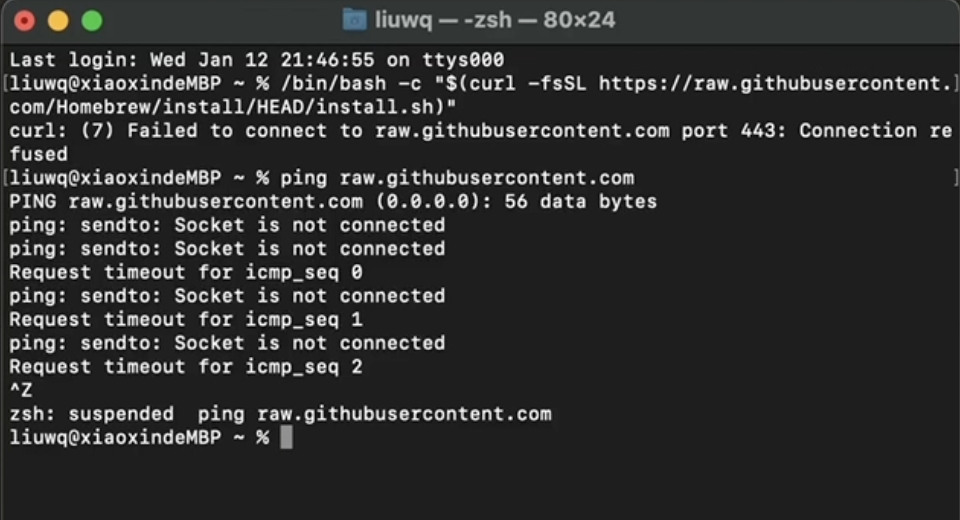
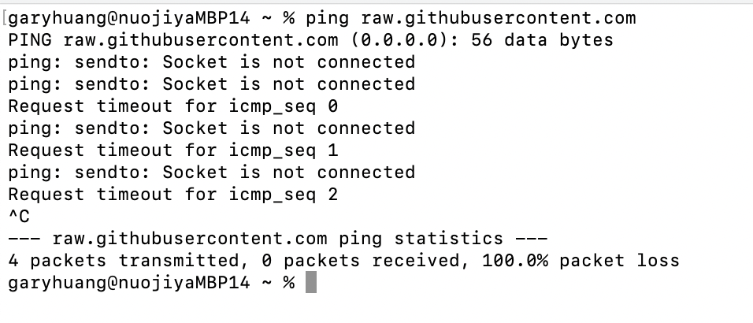
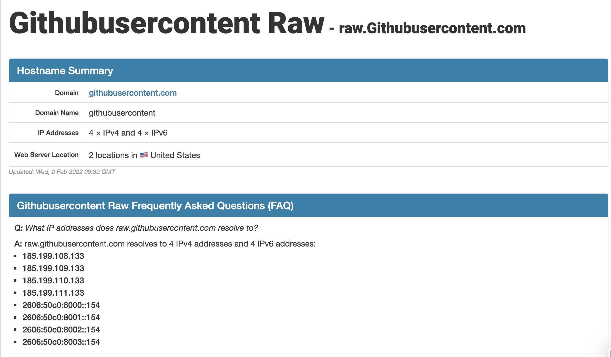
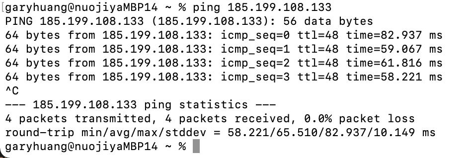
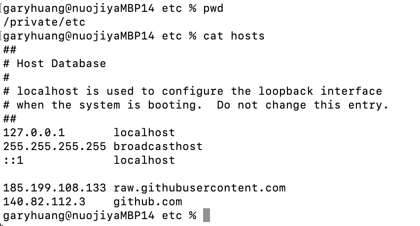
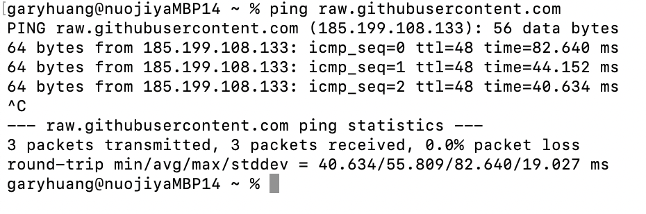
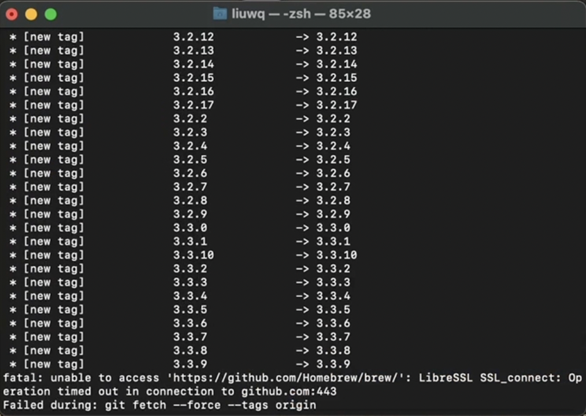

# homebrew

## 1. 什么是 homebrew
[macOS（或 Linux）缺失的软件包的管理器](https://brew.sh/)  

---

## 2. homebrew 术语
|术语|官方解释|中文翻译|例子|
|-----|----|-----|-----|
|formula|Homebrew package definition built from upstream sources|第三方软件包|foo|
|cask|Homebrew package definition that installs macOS native applications|macOS本地程序的软件包||
|keg|installation destination directory of a given formula version|第三方软件包的指定版本的安装目录|/usr/local/Cellar/foo/0.1|
|rack|directory containing one or more versioned kegs|第三方软件包的更多版本的安装目录|/usr/local/Cellar/foo|
keg-only|a formula is keg-only if it is not symlinked into Homebrew’s prefix (e.g. /usr/local)|没有建立符号链接到homebrew默认目录(/usr/local)的软件包都是keg-only|
|cellar|directory containing one or more named racks|第三方软件包的安装路径|/usr/local/Cellar|
|Caskroom|directory containing one or more named casks|macOS本地程序的软件包的安装路径|/usr/local/Caskroom|
|external command|brew subcommand defined outside of the Homebrew/brew GitHub repository|不在Homebrew/brew github范围内定义的brew子命令||
|tap|directory (and usually Git repository) of formulae, casks and/or external commands|
|bottle|pre-built keg poured into the cellar/rack instead of building from upstream sources|

---

## 3. homebrew 的常用命令
|命令|作用|官方链接|
|-----|----|-----|
|查看|
|```brew list```|查看已安装的软件包|[详情参考](https://docs.brew.sh/Manpage#list)|
|```brew search <package_name>```|搜索软件包|[详情参考](https://docs.brew.sh/Manpage#search--s-options-textregex-)|
|```brew info, brew info <package_name>```|显示所有/指定的安装的包、文件总数、总占用空间|[详情参考](https://docs.brew.sh/Manpage#info-abv-options-formulacask-)|
|```brew deps <package_name>```|查看软件包的依赖|[详情参考](https://docs.brew.sh/Manpage#deps-options-formulacask-)|
|```brew deps -—installed —-tree <package_name>```|查看已安装包依赖树|[详情参考](https://docs.brew.sh/Manpage#deps-options-formulacask-)|
|```brew --cache```|查看homebrew下载的包存放路径|[详情参考](https://docs.brew.sh/Manpage#--cache-options-formulacask-)|
|清理|
|```brew cleanup -n```|查看可清理的旧版本的包, 但不会执行清理|[详情参考](https://docs.brew.sh/Manpage#cleanup-options-formulacask-)|
|```brew cleanup <package_name>```|清理所有/具体的旧版本的包|[详情参考](https://docs.brew.sh/Manpage#cleanup-options-formulacask-)|
|安装卸载|
|```brew install <package_name>```|安装软件包|[详情参考](https://docs.brew.sh/Manpage#install-formula)|
|```brew uninstall <package_name>```|卸载软件包|[详情参考](https://docs.brew.sh/Manpage#uninstall-formula)|
|更新|
|```brew outdated```|列出可更新的已安装的软件包|[详情参考](https://docs.brew.sh/Manpage#outdated-options-formulacask-)|
|```brew update```|更新homebrew本身和所有包|[详情参考](https://docs.brew.sh/Manpage#update-options)|
|```brew upgrade, brew upgrade <package_name>```|更新所有/指定包|[详情参考](https://docs.brew.sh/Manpage#upgrade-options-outdated_formulaoutdated_cask-)|
|```brew pin <package_name>```|锁定某个软件禁止更新|[详情参考](https://docs.brew.sh/Manpage#pin-installed_formula-)|
|```brew unpin <package_name>```|解除禁更锁定|[详情参考](https://docs.brew.sh/Manpage#unpin-installed_formula-)|

---

## 4. 如何安装和卸载 homebrew
(最好还是用国内源安装, 不然会遇到奇奇怪怪的connection failure)
### 国外源
```
安装
/bin/bash -c "$(curl -fsSL https://raw.githubusercontent.com/Homebrew/install/HEAD/install.sh)"
```
```
卸载
/bin/bash -c "$(curl -fsSL https://raw.githubusercontent.com/Homebrew/install/HEAD/uninstall.sh)"
```

### 国内源
```bash
安装
/bin/zsh -c "$(curl -fsSL https://gitee.com/cunkai/HomebrewCN/raw/master/Homebrew.sh)"
```
```bash
卸载
/bin/zsh -c "$(curl -fsSL https://gitee.com/cunkai/HomebrewCN/raw/master/HomebrewUninstall.sh)"
```

homebrew 本身会默认安装到 **/opt/homebrew** [Apple Silicon] or **/usr/local/** [macOS Intel]  
homebrew 安装的软件包会默认安装到 **/opt/homebrew/Cellar** [Apple Silicon] or **/usr/local/Cellar/** [macOS Intel]

---

## 5. 安装时会遇到的问题:  
### Q1. raw.githubusercontent.com connection refused

> Solution:  
> 1. when try to ping raw.githubusercontent.com, failed
> 
> 2. then get to know the ip address of raw.githubusercontent.com from [ipaddress.com](http://ipaddress.com)
> 
> 3. if direct ping the ip, it`s ok to connect
> 
> 4. revise /private/etc/hosts (backup first)
> 
> 5. ping raw.githubusercontent.com again, success
> 
> 6. then retry install homebrew  

### Q2. github.com connection timeout, follow as Q1


### Q3. installation is very slow, and then fail
> Solution:
> 1. 先卸载已经安装了的 homebrew, 如果使用了国外源安装, 用下面的卸载命令先试一试  
> ```/bin/bash -c "$(curl -fsSL https://raw.githubusercontent.com/Homebrew/install/HEAD/uninstall.sh)"```  
> 2. 然后再试试国内源卸载命令, 清理干净  
> ```/bin/zsh -c "$(curl -fsSL https://gitee.com/cunkai/HomebrewCN/raw/master/HomebrewUninstall.sh)"```  
> 3. 再切换成国内源安装 homebrew
> ```/bin/zsh -c "$(curl -fsSL https://gitee.com/cunkai/HomebrewCN/raw/master/Homebrew.sh)"```
