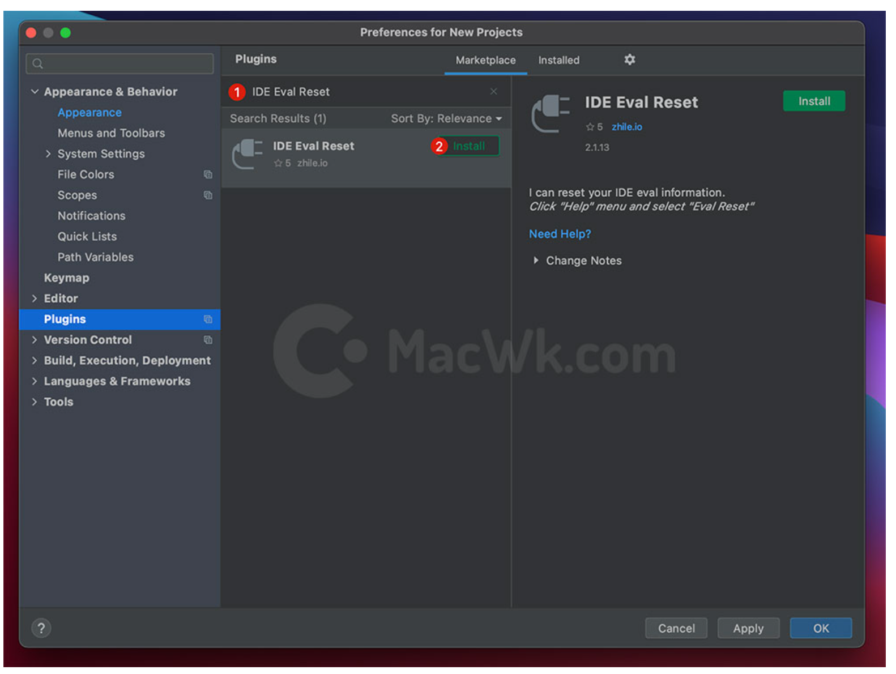

# m1 IDEA install

## 1. download IDEA
choose Apple Silicon

download and install


## 2. 破解 IDEA v2021.3.2
<!-- ### 方法一
download [破解工具](https://www.backendcloud.cn/2021/03/11/jetbrains-mac-m1/)(工具放在./markdown_source/Jetbrains2020.3及以上版本激活补丁_520xiazai.zip)   -->

<!-- ### 方法一.二
(https://www.backendcloud.cn/2021/03/11/jetbrains-mac-m1/)  
插件市场安装：
在 Settings/Preferences… -> Plugins 内手动添加第三方插件仓库地址：https://plugins.zhile.io 搜索：IDE Eval Reset 插件进行安装。


 -->

<!-- ### 方法二
download [破解工具](https://www.789zhao.com/blog/JCM0QKAP0XXS.html)(工具放在./markdown_source/ideamac2021_1_1.zip) -->


### 方法三 (亲测可用)
https://www.exception.site/essay/how-to-free-use-intellij-idea-2019-3  
(破解工具放在./markdown_source/pojieIdea/ja-netfilter-all.zip)

步骤简介: 
1. 干净卸载老版本IDEA
2. 从官网下载安装Ideav2021.3.2  
IDEA 运行成功后，会弹出对话框，提示我们需要先登录 JetBrains 账户才能使用. 这里我们先不管，先点击 Exit 退出，准备开始运行激活脚本。
3. 清空 IDEA 以前使用过的激活方式[非常重要]  
运行激活脚本之前，如果你之前安装过 IDEA, 且手动为 IDEA 修改过 hosts(/private/etc/hosts) 文件，那么添加的配置，记得要删除；引用过的补丁也要移除掉等, 不然可能会与本文提供的补丁有冲突，出现各种奇奇怪怪的问题。
如果没有动过 hosts 文件，则不用管，继续走下面的步骤。
4. 将破解工具(./markdown_source/pojieIdea/ja-netfilter-all.zip)解压放到你的本地目录, 之后就不要移动它了. 
5. for Mac, 运行 ja-netfilter-all/scripts/install.sh脚本. 这个脚本的作用如下: 
- 自动在ja-netfilter-all/vmoptions/idea.vmoptions配置文件引入破解补丁位置  
```bash
➜  ~ tail -n 1  /<your_path>/ja-netfilter-all/vmoptions/idea.vmoptions
-javaagent:/<your_path>/ja-netfilter-all/ja-netfilter.jar=jetbrains
➜  ~
```
- 自动添加idea.vmoptions文件的环境变量  
```bash
➜  ~ cat .bash_profile
___MY_VMOPTIONS_SHELL_FILE="${HOME}/.jetbrains.vmoptions.sh"; if [ -f "${___MY_VMOPTIONS_SHELL_FILE}" ]; then . "${___MY_VMOPTIONS_SHELL_FILE}"; fi
➜  ~
```
```bash
➜  ~ cat .profile
___MY_VMOPTIONS_SHELL_FILE="${HOME}/.jetbrains.vmoptions.sh"; if [ -f "${___MY_VMOPTIONS_SHELL_FILE}" ]; then . "${___MY_VMOPTIONS_SHELL_FILE}"; fi
➜  ~
```

```bash
➜  ~ tail -n 1 .zshrc
___MY_VMOPTIONS_SHELL_FILE="${HOME}/.jetbrains.vmoptions.sh"; if [ -f "${___MY_VMOPTIONS_SHELL_FILE}" ]; then . "${___MY_VMOPTIONS_SHELL_FILE}"; fi
➜  ~
```
```bash
➜  ~ cat .jetbrains.vmoptions.sh
#!/bin/sh
export IDEA_VM_OPTIONS="/<your_path>/ja-netfilter-all/vmoptions/idea.vmoptions"
export CLION_VM_OPTIONS="/<your_path>/ja-netfilter-all/vmoptions/clion.vmoptions"
export PHPSTORM_VM_OPTIONS="/<your_path>/ja-netfilter-all/vmoptions/phpstorm.vmoptions"
export GOLAND_VM_OPTIONS="/<your_path>/ja-netfilter-all/vmoptions/goland.vmoptions"
export PYCHARM_VM_OPTIONS="/<your_path>/ja-netfilter-all/vmoptions/pycharm.vmoptions"
export WEBSTORM_VM_OPTIONS="/<your_path>/ja-netfilter-all/vmoptions/webstorm.vmoptions"
export WEBIDE_VM_OPTIONS="/<your_path>/ja-netfilter-all/vmoptions/webide.vmoptions"
export RIDER_VM_OPTIONS="/<your_path>/ja-netfilter-all/vmoptions/rider.vmoptions"
export DATAGRIP_VM_OPTIONS="/<your_path>/ja-netfilter-all/vmoptions/datagrip.vmoptions"
export RUBYMINE_VM_OPTIONS="/<your_path>/ja-netfilter-all/vmoptions/rubymine.vmoptions"
export APPCODE_VM_OPTIONS="/<your_path>/ja-netfilter-all/vmoptions/appcode.vmoptions"
export DATASPELL_VM_OPTIONS="/<your_path>/ja-netfilter-all/vmoptions/dataspell.vmoptions"
export GATEWAY_VM_OPTIONS="/<your_path>/ja-netfilter-all/vmoptions/gateway.vmoptions"
export JETBRAINS_CLIENT_VM_OPTIONS="/<your_path>/ja-netfilter-all/vmoptions/jetbrains_client.vmoptions"
export JETBRAINSCLIENT_VM_OPTIONS="/<your_path>/ja-netfilter-all/vmoptions/jetbrainsclient.vmoptions"
➜  ~
```
```bash
➜  ~ cat /Users/garyhuang/Library/LaunchAgents/jetbrains.vmoptions.plist
<?xml version="1.0" encoding="UTF-8"?><!DOCTYPE plist PUBLIC "-//Apple//DTD PLIST 1.0//EN" "http://www.apple.com/DTDs/PropertyList-1.0.dtd"><plist version="1.0"><dict><key>Label</key><string>jetbrains.vmoptions</string><key>ProgramArguments</key><array><string>sh</string><string>-c</string><string>
launchctl setenv "IDEA_VM_OPTIONS" "/<your_path>/ja-netfilter-all/vmoptions/idea.vmoptions"
launchctl setenv "CLION_VM_OPTIONS" "/<your_path>/ja-netfilter-all/vmoptions/clion.vmoptions"
launchctl setenv "PHPSTORM_VM_OPTIONS" "/<your_path>/ja-netfilter-all/vmoptions/phpstorm.vmoptions"
launchctl setenv "GOLAND_VM_OPTIONS" "/<your_path>/ja-netfilter-all/vmoptions/goland.vmoptions"
launchctl setenv "PYCHARM_VM_OPTIONS" "/<your_path>/ja-netfilter-all/vmoptions/pycharm.vmoptions"
launchctl setenv "WEBSTORM_VM_OPTIONS" "/<your_path>/ja-netfilter-all/vmoptions/webstorm.vmoptions"
launchctl setenv "WEBIDE_VM_OPTIONS" "/<your_path>/ja-netfilter-all/vmoptions/webide.vmoptions"
launchctl setenv "RIDER_VM_OPTIONS" "/<your_path>/ja-netfilter-all/vmoptions/rider.vmoptions"
launchctl setenv "DATAGRIP_VM_OPTIONS" "/<your_path>/ja-netfilter-all/vmoptions/datagrip.vmoptions"
launchctl setenv "RUBYMINE_VM_OPTIONS" "/<your_path>/ja-netfilter-all/vmoptions/rubymine.vmoptions"
launchctl setenv "APPCODE_VM_OPTIONS" "/<your_path>/ja-netfilter-all/vmoptions/appcode.vmoptions"
launchctl setenv "DATASPELL_VM_OPTIONS" "/<your_path>/ja-netfilter-all/vmoptions/dataspell.vmoptions"
launchctl setenv "GATEWAY_VM_OPTIONS" "/<your_path>/ja-netfilter-all/vmoptions/gateway.vmoptions"
launchctl setenv "JETBRAINS_CLIENT_VM_OPTIONS" "/<your_path>/ja-netfilter-all/vmoptions/jetbrains_client.vmoptions"
launchctl setenv "JETBRAINSCLIENT_VM_OPTIONS" "/<your_path>/ja-netfilter-all/vmoptions/jetbrainsclient.vmoptions"
</string></array><key>RunAtLoad</key><true/></dict></plist>
➜  ~
```

6. 脚本运行成功后, 重启IDEA, 然后填入下面激活码,点击激活即可.
```
4W9NP3KV9E-eyJsaWNlbnNlSWQiOiI0VzlOUDNLVjlFIiwibGljZW5zZWVOYW1lIjoic2NyaXAgd2FuZSIsImFzc2lnbmVlTmFtZSI6IiIsImFzc2lnbmVlRW1haWwiOiIiLCJsaWNlbnNlUmVzdHJpY3Rpb24iOiIiLCJjaGVja0NvbmN1cnJlbnRVc2UiOmZhbHNlLCJwcm9kdWN0cyI6W3siY29kZSI6IklJIiwiZmFsbGJhY2tEYXRlIjoiMjAyMy0wMS0yNCIsInBhaWRVcFRvIjoiMjAyMy0wMS0yNCIsImV4dGVuZGVkIjpmYWxzZX0seyJjb2RlIjoiUERCIiwiZmFsbGJhY2tEYXRlIjoiMjAyMy0wMS0yNCIsInBhaWRVcFRvIjoiMjAyMy0wMS0yNCIsImV4dGVuZGVkIjp0cnVlfSx7ImNvZGUiOiJQV1MiLCJmYWxsYmFja0RhdGUiOiIyMDIzLTAxLTI0IiwicGFpZFVwVG8iOiIyMDIzLTAxLTI0IiwiZXh0ZW5kZWQiOnRydWV9LHsiY29kZSI6IlBHTyIsImZhbGxiYWNrRGF0ZSI6IjIwMjMtMDEtMjQiLCJwYWlkVXBUbyI6IjIwMjMtMDEtMjQiLCJleHRlbmRlZCI6dHJ1ZX0seyJjb2RlIjoiUFBTIiwiZmFsbGJhY2tEYXRlIjoiMjAyMy0wMS0yNCIsInBhaWRVcFRvIjoiMjAyMy0wMS0yNCIsImV4dGVuZGVkIjp0cnVlfSx7ImNvZGUiOiJQUEMiLCJmYWxsYmFja0RhdGUiOiIyMDIzLTAxLTI0IiwicGFpZFVwVG8iOiIyMDIzLTAxLTI0IiwiZXh0ZW5kZWQiOnRydWV9LHsiY29kZSI6IlBSQiIsImZhbGxiYWNrRGF0ZSI6IjIwMjMtMDEtMjQiLCJwYWlkVXBUbyI6IjIwMjMtMDEtMjQiLCJleHRlbmRlZCI6dHJ1ZX0seyJjb2RlIjoiUFNXIiwiZmFsbGJhY2tEYXRlIjoiMjAyMy0wMS0yNCIsInBhaWRVcFRvIjoiMjAyMy0wMS0yNCIsImV4dGVuZGVkIjp0cnVlfSx7ImNvZGUiOiJQU0kiLCJmYWxsYmFja0RhdGUiOiIyMDIzLTAxLTI0IiwicGFpZFVwVG8iOiIyMDIzLTAxLTI0IiwiZXh0ZW5kZWQiOnRydWV9LHsiY29kZSI6IlBDV01QIiwiZmFsbGJhY2tEYXRlIjoiMjAyMy0wMS0yNCIsInBhaWRVcFRvIjoiMjAyMy0wMS0yNCIsImV4dGVuZGVkIjp0cnVlfV0sIm1ldGFkYXRhIjoiMDEyMDIyMDEyMVBTQU4wMDAwMDUiLCJoYXNoIjoiVFJJQUw6LTYyNTA2MDI4NyIsImdyYWNlUGVyaW9kRGF5cyI6NywiYXV0b1Byb2xvbmdhdGVkIjpmYWxzZSwiaXNBdXRvUHJvbG9uZ2F0ZWQiOmZhbHNlfQ==-WlwI3NBiapY7em4MmP7qdZcTK2wvAt5f7FNwaH65H6SBvWnFGpe8M2VrSWCEBIGFQpv+VFJLghJKLjaRUcVOY6ttC6G4uKTpuPzELgcckez+/9DPrYj+alvLYFpS6UWy4uqzsjC/sHgcbNiCQjZQMVhj8Wflv9ts8SfWUqTwtciG8eBrzbyipXOVrRn5Wpk3l6ifL71HZsMy3bDLU8Lkt3UQBNVFZhXWBcNyY/WB9CQGX+6aXtbFA9p/hjbTZL050UoeM30rz0UkzPmfiIupbb3KNPKPArQkU8gw6pF7AcRSLuU3HNqq8RDbrXDYSXY9vtoD3Oi18ijlagVANrhjpQ==-MIIETDCCAjSgAwIBAgIBDTANBgkqhkiG9w0BAQsFADAYMRYwFAYDVQQDDA1KZXRQcm9maWxlIENBMB4XDTIwMTAxOTA5MDU1M1oXDTIyMTAyMTA5MDU1M1owHzEdMBsGA1UEAwwUcHJvZDJ5LWZyb20tMjAyMDEwMTkwggEiMA0GCSqGSIb3DQEBAQUAA4IBDwAwggEKAoIBAQCUlaUFc1wf+CfY9wzFWEL2euKQ5nswqb57V8QZG7d7RoR6rwYUIXseTOAFq210oMEe++LCjzKDuqwDfsyhgDNTgZBPAaC4vUU2oy+XR+Fq8nBixWIsH668HeOnRK6RRhsr0rJzRB95aZ3EAPzBuQ2qPaNGm17pAX0Rd6MPRgjp75IWwI9eA6aMEdPQEVN7uyOtM5zSsjoj79Lbu1fjShOnQZuJcsV8tqnayeFkNzv2LTOlofU/Tbx502Ro073gGjoeRzNvrynAP03pL486P3KCAyiNPhDs2z8/COMrxRlZW5mfzo0xsK0dQGNH3UoG/9RVwHG4eS8LFpMTR9oetHZBAgMBAAGjgZkwgZYwCQYDVR0TBAIwADAdBgNVHQ4EFgQUJNoRIpb1hUHAk0foMSNM9MCEAv8wSAYDVR0jBEEwP4AUo562SGdCEjZBvW3gubSgUouX8bOhHKQaMBgxFjAUBgNVBAMMDUpldFByb2ZpbGUgQ0GCCQDSbLGDsoN54TATBgNVHSUEDDAKBggrBgEFBQcDATALBgNVHQ8EBAMCBaAwDQYJKoZIhvcNAQELBQADggIBAB2J1ysRudbkqmkUFK8xqhiZaYPd30TlmCmSAaGJ0eBpvkVeqA2jGYhAQRqFiAlFC63JKvWvRZO1iRuWCEfUMkdqQ9VQPXziE/BlsOIgrL6RlJfuFcEZ8TK3syIfIGQZNCxYhLLUuet2HE6LJYPQ5c0jH4kDooRpcVZ4rBxNwddpctUO2te9UU5/FjhioZQsPvd92qOTsV+8Cyl2fvNhNKD1Uu9ff5AkVIQn4JU23ozdB/R5oUlebwaTE6WZNBs+TA/qPj+5/we9NH71WRB0hqUoLI2AKKyiPw++FtN4Su1vsdDlrAzDj9ILjpjJKA1ImuVcG329/WTYIKysZ1CWK3zATg9BeCUPAV1pQy8ToXOq+RSYen6winZ2OO93eyHv2Iw5kbn1dqfBw1BuTE29V2FJKicJSu8iEOpfoafwJISXmz1wnnWL3V/0NxTulfWsXugOoLfv0ZIBP1xH9kmf22jjQ2JiHhQZP7ZDsreRrOeIQ/c4yR8IQvMLfC0WKQqrHu5ZzXTH4NO3CwGWSlTY74kE91zXB5mwWAx1jig+UXYc2w4RkVhy0//lOmVya/PEepuuTTI4+UJwC7qbVlh5zfhj8oTNUXgN0AOc+Q0/WFPl1aw5VV/VrO8FCoB15lFVlpKaQ1Yh+DVU8ke+rt9Th0BCHXe0uZOEmH0nOnH/0onD
```
激活成功后，不要升级 IDEA 版本  
前文中的环境变量，小伙伴也看到了，对应了你放置补丁位置的路径，删除掉或者移动，再打开 IDEA 就找不到对应文件了，激活也就失效了。放着吃灰就行，别动它。 
