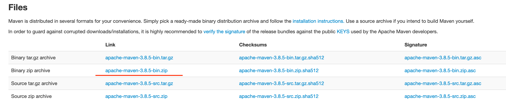

# m1 Maven install

## 1. download from Maven
go to [maven download page](https://maven.apache.org/download.cgi), choose ***apache-maven-3.8.5-bin.zip*** to download  

then unzip to your path  
```bash
➜  devTools ls
apache-maven-3.8.5         apache-maven-3.8.5-bin.zip
➜  devTools pwd                      
/Users/garyhuang/gary/devTools
➜  devTools 
```

## 2. setup maven env variable
update ~/.zshrc, new MAVEN_HOME and add MAVEN_HOME to PATH as below


then reset config
```bash
source ~/.zshrc
```
and if you run mvn -v show like below, your maven env var has been setup successfully


## 3. config maven repository path
we should specifiy where maven store the downloaded dependencies and jars  
firstly create a folder(maven_repo) under where you like(I put in same path as maven_home) 
```bash
➜  devTools pwd
/Users/garyhuang/gary/devTools
➜  devTools ll
total 0
drwxr-xr-x@ 9 garyhuang  staff   288B  3  5 11:30 apache-maven-3.8.5
drwxr-xr-x  2 garyhuang  staff    64B  3 15 22:18 maven_repo
➜  devTools
```
then update maven configuration ($MAVEN_HOME/conf/settings.xml)  
from

to
```xml
<localRepository>/Users/garyhuang/gary/devTools/maven_repo</localRepository>
```


## 4. 配置阿里云源
update maven configuration ($MAVEN_HOME/conf/settings.xml)  
from

to  

https://developer.aliyun.com/mvn/guide  

then try run ```mvn help:system```, you will find the dependencies are downloaded into ***maven_repo*** folder 


