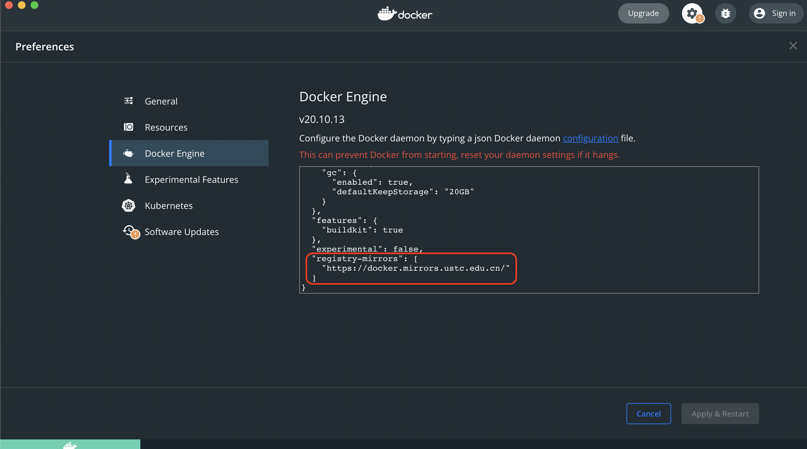
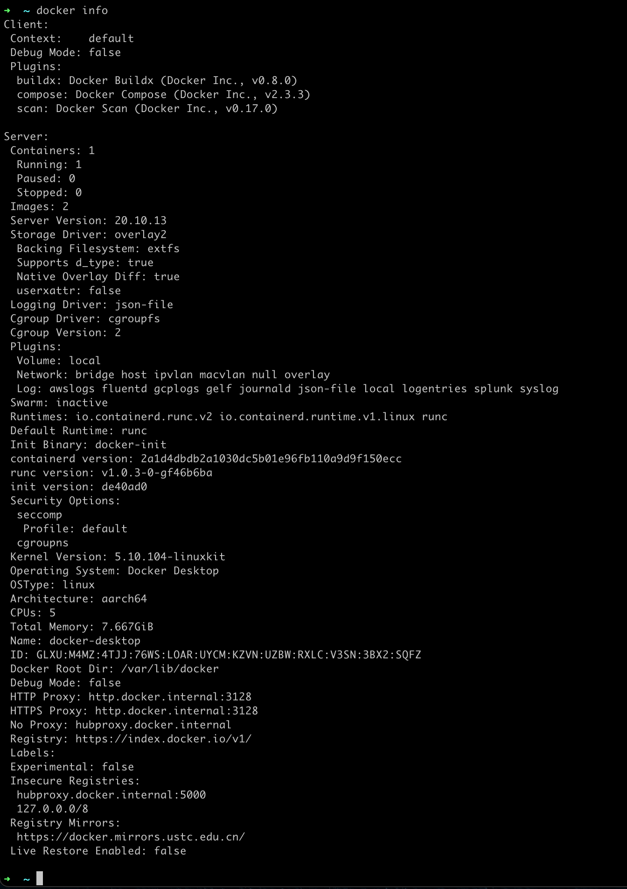

# m1 docker install

## 1. 下载安装
Go to https://docs.docker.com/desktop/mac/apple-silicon/ and click [Mac with Apple chip] to install dmg package


> * Here is an optional requirement, to have a best experience for docker, it`s better to install Rosetta2 in your mac, so run below command. But as your macos is Monterey(v12.1), Rosetta2 should be defaultly installed, this step is optional.
> ```bash
> softwareupdate --install-rosetta
> ```

## 2. 配置国内镜像源
科大镜像：https://docker.mirrors.ustc.edu.cn/  
网易：https://hub-mirror.c.163.com/  
阿里云：https://<你的ID>.mirror.aliyuncs.com  
七牛云加速器：https://reg-mirror.qiniu.com  

添加镜像源到docker

```json
"registry-mirrors": [
    "https://docker.mirrors.ustc.edu.cn/"
]
```  
然后点"Apply & Restart"


## 3. docker 配置
check docker info
```bash
docker info
```


镜像放在那里?
/Users/garyhuang/Library/Containers/com.docker.docker/Data/vms/0/data

## 4. docker常用命令
[官方参考](https://docs.docker.com/engine/reference/run/)
|用法|作用|常用参数|参数作用|例子|
|----|----|----|----|----|
|docker [COMMAND] --help|查看所有/指定命令的用法|||docker pull --help|
|镜像相关|
|docker images [OPTIONS] [REPOSITORY[:TAG]]|查看本地镜像的信息, 不带参数默认列出所有镜像,参数可指定特定仓库/特定tag的镜像|||docker images|
|docker search [OPTIONS] TERM|搜索docker hub上的镜像|||docker search java|
|docker pull [OPTIONS] NAME[:TAG\|@DIGEST]|下载镜像, 可以指定tag, 默认是latest|||docker pull tomcat; docker pull tomcat:jre8-openjdk-slim|
|docker rmi [OPTIONS] IMAGE [IMAGE...]|移除本地镜像. 如果镜像有正在运行的容器,需要加参数--force或者-f才能移除. 如果需要移除镜像的某个版本,需要指明tag|||docker rmi testImage; docker rmi testImag2:tagv1; docker rmi -f runningImage|
|容器运行相关|
|用法|作用|常用参数|参数作用|例子|
|docker run [OPTIONS] IMAGE [COMMAND] [ARG...]|为镜像运行容器||
|docker run||-d|Run container in background and print container ID|docker run -d ubuntu|
|docker run||--expose|Expose a port or a range of ports|docker run --expose 80 ubuntu bash (This exposes port 80 of the container without publishing the port to the host system’s interfaces.)|
|docker run||--publish, -p|Publish a container's port(s) to the host| docker run -p 127.0.0.1:80:8080/tcp ubuntu bash (This binds port 8080 of the container to TCP port 80 on 127.0.0.1 of the host machine); docker run -p <host_port>:<container_port>|
|docker run||--publish-all, -P|Publish all exposed ports to random ports||
|docker run||--tty, -t|Allocate a pseudo-TTY; 分配一个模拟输入终端|docker run -it ubuntu:15.10 /bin/bash  (The -it instructs Docker to allocate a pseudo-TTY connected to the container’s stdin; creating an interactive bash shell in the container)  (/bin/bash：放在镜像名后的是命令, 这里我们希望有个交互式 Shell, 因此用的是 /bin/bash)|
|docker run||--interactive, -i|Keep STDIN open even if not attached 保持输入终端连接着|docker run --name test -it debian|
|docker ps [OPTIONS]|默认查看正在运行的容器, 参数-a则查看所有容器, 参数-q only show container ID, 参数-f/--filter "key=value"|||docker ps 查看运行的容器; docker ps -a 查看所有容器; docker ps -aq -f "name=xxx" show container ID for those container name = xxxx |
|docker top CONTAINER [ps OPTIONS]|查看容器中运行的进程|||docker top testContainerName|
|docker inspect [OPTIONS] NAME\|ID [NAME\|ID...]|查看容器的docker底层信息,默认以json格式显示|||docker inspect testContainerName|
|docker start [OPTIONS] CONTAINER [CONTAINER...]|启动一个或多个停止的容器|||docker start my_container|
|docker stop [OPTIONS] CONTAINER [CONTAINER...]|停止一个或多个正在运行的容器|||docker stop my_container|
|docker rm [OPTIONS] CONTAINER [CONTAINER...]|移除容器, 如果容器正在运行, 需要参数-f|||docker rm -f redis|
|docker port CONTAINER [PRIVATE_PORT[/PROTO]]|查看容器的端口映射|||docker port testContainerName|
|docker logs [OPTIONS] CONTAINER|查看容器里的日志|--follow , -f|continue streaming the new output from the container’s STDOUT and STDERR|docker logs -f testContainerName|
|docker exec [OPTIONS] CONTAINER COMMAND [ARG...]|在运行中的容器中运行命令行||docker exec -it 243c32535da7 /bin/bash||
|构建镜像相关|
|用法|作用|常用参数|参数作用|例子|
|docker commit [OPTIONS] CONTAINER [REPOSITORY[:TAG]]|Create a new image from a container’s changes; 根据现有容器的变更, 构建一个新的镜像, ***不推荐***|--author, -a : 作者; --message , -m : 提交信息;||docker commit c3f279d17e0a  svendowideit/testimage:version3;  docker commit -m="has update" -a="runoob" e218edb10161 runoob/ubuntu:v2|
|docker build [OPTIONS] PATH \| URL \| -|从DockerFile构建镜像, ***推荐***|||[详解参考 4. DockerFile Details](#4-dockerfile-details)|
|docker tag SOURCE_IMAGE[:TAG] TARGET_IMAGE[:TAG]|为镜像打tag|
|docker tag|||Tag an image referenced by ID | docker tag 0e5574283393 fedora/httpd:version1.0|
|docker tag|||Tag an image referenced by Name | docker tag httpd fedora/httpd:version1.0|
|docker tag|||Tag an image referenced by Name and Tag| docker tag httpd:test fedora/httpd:version1.0.test|
|docker tag|||Tag an image for a private repository|docker tag 0e5574283393 myregistryhost:5000/fedora/httpd:version1.0|


## 5. DockerFile Details
docker build [OPTIONS] PATH|URL|-  
"PATH|URL|-" is context, 上下文路径, docker 在构建镜像时, 有时候想要使用到本机的文件(比如复制), docker build 命令得知这个路径后, 会将路径下的所有内容打包.  
- The PATH is a directory on your local filesystem.  
- The URL is a Git repository location.  

eg.  
|例子|说明|
|-|-|
|docker build -t nginx:v3 .|-t:指定构建的镜像名字; ".":上下文为当前目录|
|docker build -t nginx:v3 -f myDockerFile .|-f:指定dockerfile|


|命令|用法|例子|解析|
|--|--|--|--|
|FROM|FROM [--platform=\<platform>] \<image> [AS \<name>]|引入父镜像|
|LABEL||
|RUN |RUN \<command>; RUN ["executable", "param1", "param2"]|RUN ["/bin/bash", "-c", "echo hello"]; RUN /bin/bash -c echo "hello"|docker build 时运行命令|
|CMD |CMD ["executable","param1","param2"];|CMD ["/usr/bin/wc","--help"]|docker run 时运行命令. If you list more than one CMD then only the last CMD will take effec; The main purpose of a CMD is to provide defaults for an executing container; If the user specifies arguments to docker run then they will override the default specified in CMD; 只有最后一个CMD生效, CMD用于提供默认执行命令, docker run的参数会覆盖CMD|
|ENTRYPOINT|ENTRYPOINT ["executable", "param1", "param2"]|ENTRYPOINT ["/usr/sbin/apache2ctl", "-D", "FOREGROUND"]|docker run 时运行命令. 但其不会被 docker run 的命令行参数指定的指令所覆盖, 而且这些命令行参数会被当作参数送给 ENTRYPOINT 指令指定的程序; 只有最后一个ENTRYPOINT生效|
|EXPOSE|EXPOSE \<port> [\<port>/\<protocol>...]|EXPOSE 80/tcp|声明容器运行时的监听端口
|ENV|ENV \<key>=\<value> ...|ENV MY_NAME="John Doe"|定义环境变量, 后续dockerFile指令可用
|ADD|ADD [--chown=\<user>:\<group>] \<src>... \<dest>|ADD hom* /mydir/; ADD test.txt relativeDir/|复制文件, 在执行\<源文件>为 tar 压缩文件的话, 压缩格式为 gzip, bzip2 以及 xz 的情况下, 会自动复制并解压到 <目标路径>|
|COPY |COPY [--chown=\<user>:\<group>] \<src>... \<dest>|COPY test.txt relativeDir/|复制文件, 不解压|
|VOLUME|VOLUME ["/data"]||The VOLUME instruction creates a mount point with the specified name and marks it as holding externally mounted volumes from native host or other containers.|
|USER|USER \<user>[:\<group>]|USER patrick|用于指定执行后续命令的用户和用户组, 这边只是切换后续命令执行的用户(用户和用户组必须提前已经存在)|
|WORKDIR|WORKDIR <工作目录路径>|WORKDIR /path/to/workdir|指定工作目录。用 WORKDIR 指定的工作目录, 会在构建镜像的每一层中都存在。(WORK)IR 指定的工作目录, 必须是提前创建好的）。docker build 构建镜像过程中的, 每一个 RUN 命令都是新建的一层。只有通过 WORKDIR 创建的目录才会一直存在。|
|ONBUILD|ONBUILD \<其它指令>||用于延迟构建命令的执行。简单的说, 就是 Dockerfile 里用 ONBUILD 指定的命令, 在本次构建镜像的过程中不会执行(假设镜像) test-build）。当有新的 Dockerfile 使用了之前构建的镜像 FROM test-build , 这时执行新镜像的 Dockerfile 构建时候, 会执行 test-build 的 Dockerfile 里的 ONBUILD 指定的命令|


