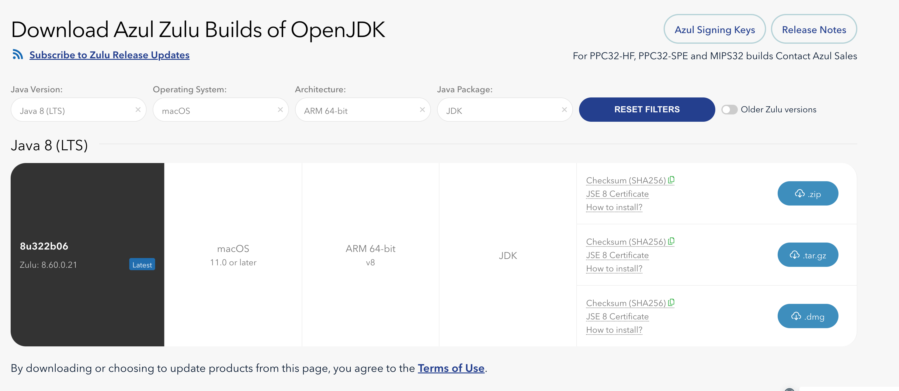
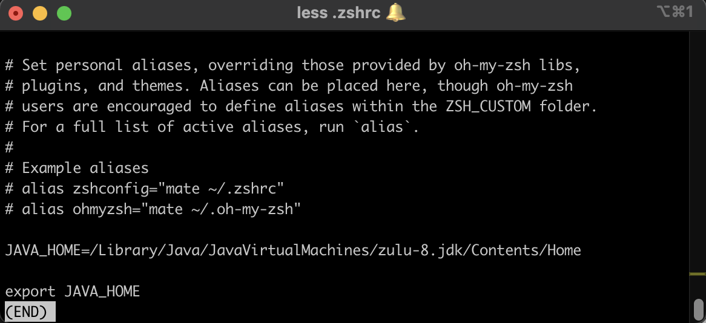
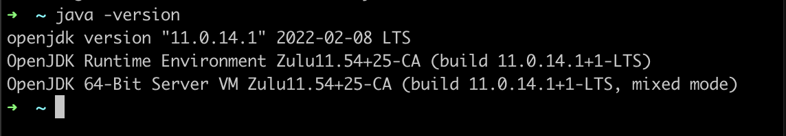

# jdk in M1

## 1. download and install from azul
[azul download](https://www.azul.com/downloads/?version=java-8-lts&os=macos&architecture=arm-64-bit&package=jdk) with version=java-8-lts, os=macos, architecture=arm-64-bit, package=jdk

Install the dmg package.  
Zulu JDK default located under ***/Library/Java/JavaVirtualMachines/zulu-8.jdk***
```bash
➜  zulu-8.jdk java -version
openjdk version "1.8.0_322"
OpenJDK Runtime Environment (Zulu 8.60.0.21-CA-macos-aarch64) (build 1.8.0_322-b06)
OpenJDK 64-Bit Server VM (Zulu 8.60.0.21-CA-macos-aarch64) (build 25.322-b06, mixed mode)
➜  zulu-8.jdk pwd
/Library/Java/JavaVirtualMachines/zulu-8.jdk
➜  zulu-8.jdk
```

update /Users/\<username>/.zshrc as below 
```bash
JAVA_HOME=/Library/Java/JavaVirtualMachines/zulu-8.jdk/Contents/Home

export JAVA_HOME
```



## 2. multiple version jdk install 
if you have multiple jdks installed, just update /Users/\<username>/.zshrc for JAVA_HOME pointing to which version you want
```bash
(switch from java8 to java11)
#JAVA_HOME=/Library/Java/JavaVirtualMachines/zulu-8.jdk/Contents/Home

JAVA_HOME=/Library/Java/JavaVirtualMachines/zulu-11.jdk/Contents/Home

export JAVA_HOME
```
switch successfully


